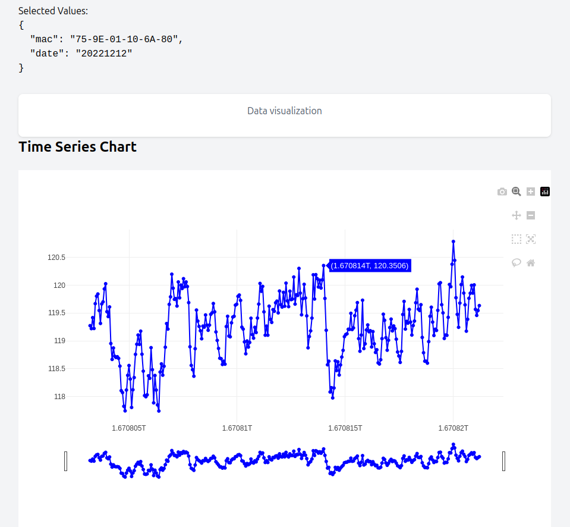
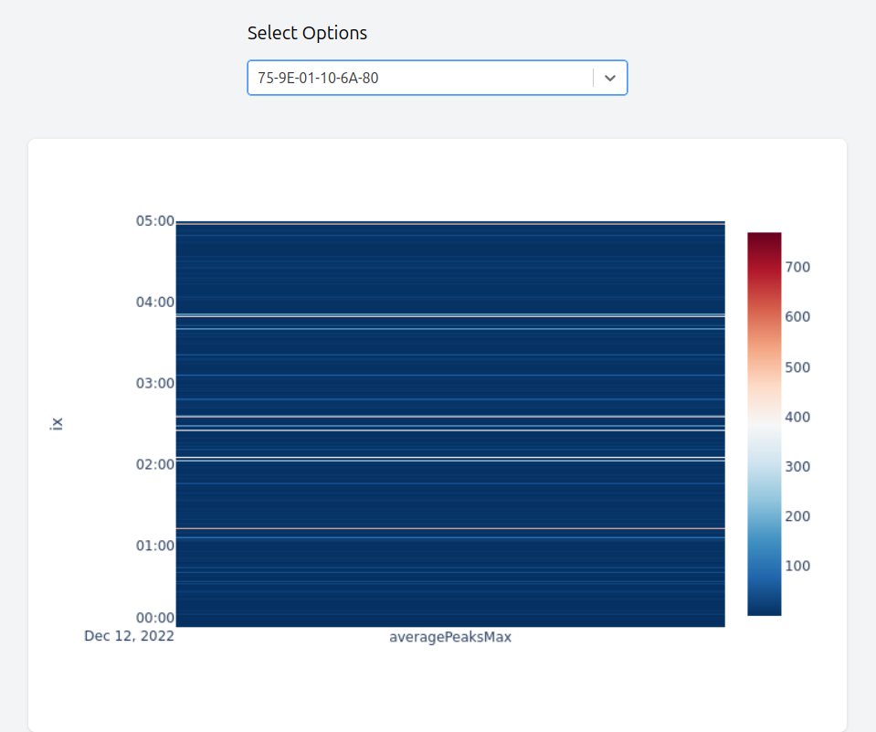

# Sample project

The main elements involve integrating with an API and

(1) displaying a selector of options based on one API response,

(2) displaying or plotting (tabular or graph) data from a second endpoint, using Python and/or JavaScript frameworks.

---

## Interactive Plot
Display time series data on an interactive Plotly chart showing fluctuations in voltage

## Heatmap static plot
Show a heatmap to highlight high average peaks

---
TODO: Add Lat-Lon data and present devices on a map with ability to draw boundaries and show data for locations.
